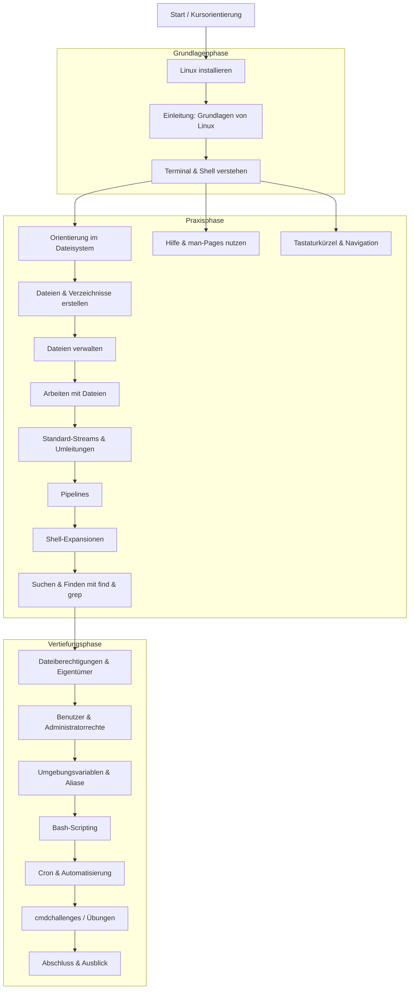

# Linux CLI Kurs – Testdaten & Übungen

Willkommen zu den Kursunterlagen **Linux CLI – Die Macht der universellen Linux-Befehle**.


Dieses Repository enthält alle **Übungsdateien**, die im Online-Kurs und Buch verwendet werden.  
Damit kannst du Schritt für Schritt alle Beispiele selbst nachvollziehen und ausprobieren.

📘 **Kursseite:** [pixeledi.eu/akademie/linux-cli](https://pixeledi.eu/akademie/linux-cli)


## 🧭 Linux CLI Cheatsheet 

> 🧠 **Tipp:**  
> Meine kompakte Zusammenfassung aller wichtigen Befehle findest du im folgenden Dokument: 
> 👉 [**Linux CLI Cheatsheet**](./linux_cli_cheatsheet.md)


## 🧰 Inhalt

* **`linux_cli_dummydata.sh`**
  Ein Bash-Skript, das automatisch alle Übungsordner und Beispieldateien erstellt.
  Es dient als Ausgangspunkt für viele Kapitel im Buch/Kurs.

* **`dummydata/`**
  Eine bereits vorbereitete Version der Testdaten – falls das Skript bei dir nicht funktioniert.

* **`codeblocks/`**
  Enthält automatisch extrahierte **Befehls- und Codebeispiele** aus allen Kapiteln.
  Diese Dateien werden aus den Markdown-Quellen generiert und dienen als **Referenz**, **Testbasis** oder **Übersicht aller im Buch verwendeten CLI-Befehle**.
  So kannst du alle im Kurs vorkommenden Kommandos gesammelt sehen oder direkt in deine eigene Shell kopieren.


## 🚀 Anleitung

1. Lade das Repository herunter

   ```bash
   git clone git@github.com:pixelEDI/linux-cli-course.git 
   cd linux-cli-book
   ```

2. Mach das Skript ausführbar

   ```bash
   chmod +x linux_cli_dummydata.sh
   ```

3. Führe es aus (am besten im Home-Verzeichnis)

   ```bash
   cd ~
   ./linux_cli_dummydata.sh
   ```

Nach der Ausführung findest du alle Testordner und -dateien,
die du für die Übungen im Kurs/Buch brauchst.

## ⚙️ Fallback (falls das Skript nicht funktioniert)

Falls das Skript bei dir nicht läuft – z. B. wegen fehlender Berechtigungen
oder auf einem eingeschränkten System – kannst du die Testdaten auch **manuell** verwenden:

1. Lade den Ordner `dummydata/` direkt über den blauen **„Code“**-Button herunter
   *(„Download ZIP“ auswählen)*
2. Entpacke den Ordner in dein Home-Verzeichnis (`~/`)
3. Du kannst sofort mit den Übungen starten, ohne das Skript auszuführen.


## Kurssruktur



## 💡 Tipp

Wenn du eigene Anpassungen machst oder zusätzliche Beispiele entwickelst,
freue ich mich über Pull Requests oder Vorschläge im Repository.
So wächst der Kurs mit der Community weiter.

Viel Spaß beim Üben und Lernen mit der Kommandozeile!
**– pixeledi**

